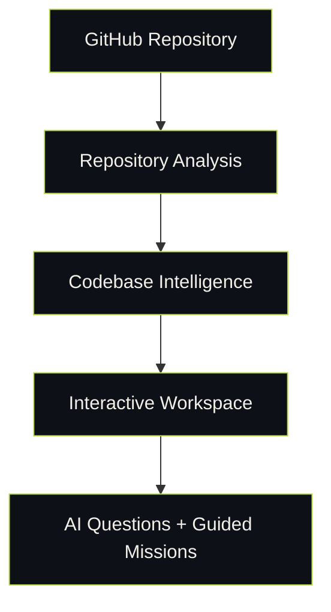
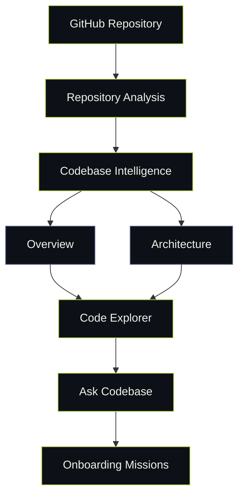
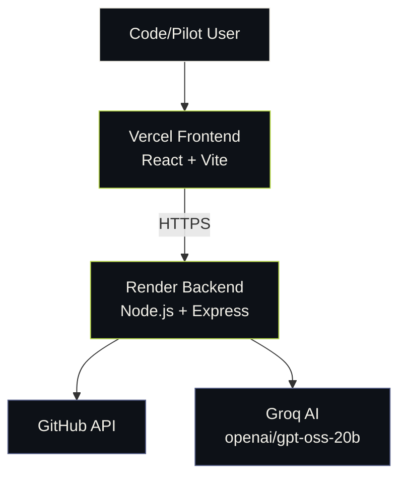

<div align="center">

# Code/Pilot

### AI-powered interactive onboarding for unfamiliar GitHub codebases

Turn any public repository into a guided, explorable developer workspace — architecture, code, setup, and AI-powered answers, all in one place.

[](https://code-pilot-tawny.vercel.app/)
[](https://github.com/drmungur/CodePilot)
[](#built-with-ibm-bob-20)

<br/>

**[Live Demo](https://code-pilot-tawny.vercel.app/)** &nbsp;·&nbsp; **[View Source](https://github.com/drmungur/CodePilot)** &nbsp;·&nbsp; **[Report an Issue](https://github.com/drmungur/CodePilot/issues)**

</div>

<br/>

## Table of Contents

- [The Problem](#the-problem)
- [The Solution](#the-solution)
- [Features](#features)
- [How It Works](#how-it-works)
- [Tech Stack](#tech-stack)
- [Architecture](#architecture)
- [Built with IBM Bob 2.0](#built-with-ibm-bob-20)
- [Getting Started](#getting-started)
- [Project Structure](#project-structure)
- [Security](#security)
- [Hackathon](#hackathon)

<br/>

## The Problem

Joining an unfamiliar codebase is hard. Every new developer has to independently figure out:

- Where the application starts
- How the architecture is organized
- Which files actually matter
- How requests flow through the system
- Where authentication and the data layer live
- How to run the project locally
- What they should learn first

Traditional documentation is often incomplete, outdated, or disconnected from the actual code — leaving developers to reverse-engineer everything by hand.

<br/>

## The Solution

**Code/Pilot** analyzes a public GitHub repository and builds an interactive onboarding experience around it — turning exploration into a guided, structured workflow.



<br/>

## Features

<table>
<tr>
<td width="50%">

### Repository Mapping
Paste a public GitHub URL and Code/Pilot analyzes its structure, technologies, important files, and repository statistics.

</td>
<td width="50%">

### Overview
Get a high-level understanding of the repository without manually digging through every file.

</td>
</tr>
<tr>
<td width="50%">

### Architecture
Explore how the major parts of the repository are organized and how they relate to one another.

</td>
<td width="50%">

### Code Explorer
Identify important files and explore the repository through a focused, curated set of relevant code.

</td>
</tr>
<tr>
<td width="50%">

### Setup Guide
Get repository-specific guidance for understanding how the project is configured and run.

</td>
<td width="50%">

### Ask Codebase
Ask natural-language questions about the repository and get AI-generated answers grounded in the actual code.

</td>
</tr>
</table>

### Onboarding Missions

Code/Pilot turns passive exploration into **active, guided learning**:

1. Find the entry point
2. Trace an API request end-to-end
3. Explore authentication
4. Explore the data layer

> The goal isn't just to *explain* a codebase — it's to help developers actively **learn** it.

<br/>

## How It Works



<br/>

## Tech Stack

<table>
<tr>
<td valign="top" width="25%">

**Frontend**


- React
- Vite
- JavaScript
- CSS

</td>
<td valign="top" width="25%">

**Backend**


- Node.js
- Express
- GitHub API
- Repository analysis & classification

</td>
<td valign="top" width="25%">

**AI**


- Groq
- OpenAI-compatible chat completions
- `openai/gpt-oss-20b`

</td>
<td valign="top" width="25%">

**Deployment**


- Vercel — frontend
- Render — backend
- GitHub — source

</td>
</tr>
</table>

<br/>

## Architecture



<br/>

## Built with IBM Bob 2.0

Code/Pilot was developed using **IBM Bob 2.0** throughout the hackathon, across six documented task sessions:

| # | Session | Focus |
|:-:|---|---|
| 01 | **Foundation** | Repository analysis & backend foundations |
| 02 | **Workspace** | Results workspace implementation |
| 03 | **AI** | AI provider integration |
| 04 | **UI** | UI and UX development |
| 05 | **Intelligence** | Repository intelligence |
| 06 | **Missions** | Interactive onboarding missions |

Development evidence — screenshots documenting each Bob task session — is included in [`bob_sessions/`](./bob_sessions).

<br/>

## Getting Started

### 1. Clone the repository

```bash
git clone https://github.com/drmungur/CodePilot.git
cd Code/Pilot
```

### 2. Start the backend

```bash
cd backend
npm install
npm start
```

Create `backend/.env` from `backend/.env.example` and provide your own Groq API key:

```env
AI_PROVIDER=groq
GROQ_API_KEY=your_groq_api_key
GROQ_MODEL=openai/gpt-oss-20b
```

The backend runs at **`http://localhost:3001`**.

### 3. Start the frontend

In a new terminal:

```bash
cd frontend
npm install
npm run dev
```

<br/>

## Project Structure

```text
CodePilot/
├── backend/
│   ├── lib/
│   │   ├── analyze.js
│   │   ├── classifier.js
│   │   └── github.js
│   ├── .env.example
│   ├── package.json
│   └── server.js
│
├── frontend/
│   ├── public/
│   ├── src/
│   ├── index.html
│   ├── package.json
│   └── vite.config.js
│
├── bob_sessions/
│   ├── task01_repo_analysis.png
│   ├── task02_results_views.png
│   ├── task03_ai_integration.png
│   ├── task04_ui_redesign.png
│   ├── task05_repository_intelligence.png
│   └── task06_interactive_missions.png
│
├── .gitignore
└── README.md
```

<br/>

## Security

- API keys are stored in environment variables and are **never** committed to the repository.
- Do not commit `.env` files or API keys.
- Only analyze public repositories whose contents are permitted to be accessed and used.

<br/>

## Hackathon

Built for the **IBM Bob 2.0 Hackathon**.

Code/Pilot focuses on the developer onboarding workflow — helping developers move from an unfamiliar repository to a structured understanding of its architecture, code, setup, and development path.

<br/>

<div align="center">

---

**[Live Demo](https://code-pilot-tawny.vercel.app/)** &nbsp;·&nbsp; **[GitHub](https://github.com/drmungur/CodePilot)**

Built for the IBM Bob 2.0 Hackathon

</div>
